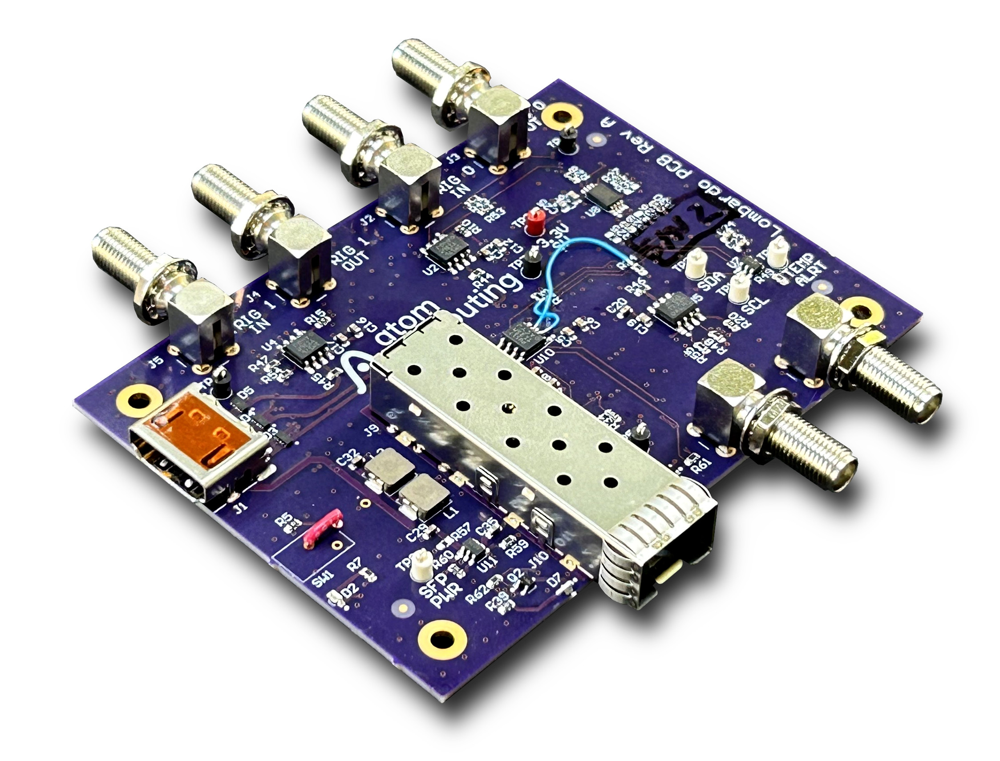

# Lombardo Extender Board

Extender board for the front-panel connector on the [DAMC-FMC2ZUP
carrier](https://innovation.desy.de/technologies/microtca/boards/damc_fmc2zup/index_eng.html)
(commercially available at [CAEN
ELS](https://www.caenels.com/product/damc-fmc2zup/)).



## Features

* SFP+ cage, connected to the transceiver pins
* 2 trigger inputs and outputs (direction is SW configurable)
* clock input and output (direction is SW configurable)
* I2C EEPROM to store the identification information of the board
* I2C temperature sensor to monitor the board temperature


## License

Copyright (c) 2024, Atom Computing, Inc.

This project is licensed under CC BY-SA 4.0. See the [LICENSE.md](LICENSE.md)
file for details.


## Usage

### I2C communication, trigger and clock inputs/outputs

There are some I2C devices that need to be configured on this board at the
startup. The FPGA project on DAMC-FMC2ZUP should include an I2C controller
connected to the I2C bus that is connected to the front-panel connector. Please
refer to the [DAMC-FMC2ZUP - User's
Manual](https://www.caenels.com/product/damc-fmc2zup/) for information about the
pinout.

Similarly, all the differential pairs that are needed for triggers and clock
need to be instantiated.


### Connecting the board

Connect the board using to the front-panel connector of the DAMC-FMC2ZUP carrier
with a Micro HDMI to HDMI cable (see the list of tested cables
[below](#list-of-tested-hardware)) and turn on the switch. Please note that
some variants might not have a switch and the board turns on immediately when
connected to the carrier.

The LED D2 should turn on, indicating that the board is powered on.


### Initial check

Assuming you are running Linux on DAMC-FMC2ZUP, you can check whether the board
is operational by running `i2cdetect` command with the appropriate I2C bus
number (use `i2cdetect -l` to list all I2C buses).

```console
root@damc-fmc2zup:~# i2cdetect -l
i2c-3	i2c       	xiic-i2c [i2c_fplink]           	I2C adapter
i2c-1	i2c       	Cadence I2C at ff030000         	I2C adapter
i2c-4	i2c       	xiic-i2c [i2c_mmc]              	I2C adapter
i2c-2	i2c       	ZynqMP DP AUX                   	I2C adapter
i2c-0	i2c       	Cadence I2C at ff020000         	I2C adapter
i2c-5	i2c       	xiic-i2c [i2c_osc]              	I2C adapter
root@damc-fmc2zup:~# i2cdetect -r -y 3
     0  1  2  3  4  5  6  7  8  9  a  b  c  d  e  f
00:          -- -- -- -- -- -- -- -- -- -- -- -- --
10: -- -- -- -- -- -- -- -- -- -- -- -- -- -- -- --
20: -- -- -- -- -- -- -- -- -- -- -- -- -- -- -- --
30: -- -- -- -- -- -- -- -- -- 39 3a -- -- -- -- --
40: -- -- -- -- -- -- -- -- -- 49 -- -- -- -- -- --
50: -- -- -- -- 54 -- -- -- -- -- -- -- -- -- -- --
60: -- -- -- -- -- -- -- -- -- -- -- -- -- -- -- --
70: -- -- -- -- -- -- -- --
```

As shown in the example above, there should be 4 devices detected on the I2C
bus: 2 GPIO controllers at addresses 0x39 and 0x3a, an EEPROM at the address
0x54, and the temperature sensor at the address 0x49. When the SFP/SFP+ module
is enabled and inserted, there should be additional devices detected.

### Provided tools

#### Device tree overlay

The device tree overlay that describes this board is provided in the
`tools/device-tree-overlay` directory. To compile the overlay, run `make`, and
to load it run `make load`. This will load the drivers for the GPIO controllers,
the EEPROM, and the temperature sensor.

If you need to unload the overlay, run `make unload`.

#### Field Replaceable Unit (FRU)

The boards produced by Atom Computing have the EEPROM populated with the FRU
information, compliant with the IPMI FRU specification. To read the information,
dump the EEPROM to a file and run the `frugy` utility on it. Since the EEPROM
does not have a write-protect pin, please be careful when using it in order not
to overwrite the information.

```console
root@damc-fmc2zup:~# cat /sys/class/i2c-dev/i2c-3/device/3-0054/eeprom > fru.bin
root@damc-fmc2zup:~# frugy -d fru.bin

BoardInfo:
  mfg_date_time: 2024-07-08 17:25:00
  manufacturer: Atom Computing
  product_name: Lombardo
  serial_number: '1'
  part_number: '0000'
  fru_file_id: none

ProductInfo:
  manufacturer: Atom Computing
  product_name: Lombardo
  part_number: '0000'
  version: revA
  serial_number: '1'
  asset_tag: none
  fru_file_id: none
```

If you need to populate the EEPROM with the FRU information, there are a
template and instructions provided in the `tools/fru` directory.

#### SFP/SFP+ module

To enable the power to the SFP/SFP+ module and to enable the I2C communication
and enable the transmitter, run the following commands (after loading the device
tree overlay described in [Device tree overlay](#device-tree-overlay)):

```
root@damc-fmc2zup:~# gpioset $(gpiofind lombardo_sfp_power_en)=1
root@damc-fmc2zup:~# gpioset $(gpiofind lombardo_sfp_i2c_en)=1
root@damc-fmc2zup:~# gpioset $(gpiofind lombardo_sfp_tx_disable)=0
```

After that, you can use the SFP utility to read the information from the
SFP/SFP+ module. The SFP utility is provided in the `tools/sfp` directory. The
argument is the I2C bus number, the same as the one used to detect the devices
with the `i2cdetect` command.

```console
root@damc-fmc2zup:~/lombardo/tools/sfp-util# ./lombardo_sfp_info.py 3
  Info:
    Vendor name      : FS
    Vendor PN        : SFP-10GSR-85
    Vendor rev       : A
    Vendor SN        : F2310330129
    Vendor OUI       : 64:9d:99
    Date code        : 2023-09-22
    Wavelength       : 850 nm
    Length (OM2/50um): 300 m
    Length (OM4/50um): 0 m
    Encoding         : 0x06 (64B/66B)
    Baud rate        : 10300 Mbit/s
    Options:         : 0x001a
      Retimer/CDR      : 0
      Rate Select      : 0
      Tx Disable       : 1
      Tx Fault         : 1
      Loss of Signal   : 1
    Diagnostic       : 0x68
      Addr change      : 1
      External calib   : 0
      Internal calib   : 1
      DDM implemented  : 1
  Monitor:
    Temp     : 30.84 degC
    Vcc      : 3.121 V
    Tx Bias  : 6.05 mA
    Tx Power : 0.513 mW
    Rx Power : 0.497 mW
    Status/Control: 0x08
      Tx Disable: 0
      RS1 State : 0
      RS0 State : 0
      Tx Fault  : 0
      Rx LOS    : 0
```

## List of tested hardware

### Micro HDMI to HDMI cables

  * UGREEN 8K Micro HDMI to HDMI Cable 3.3FT, 2.1 Aluminum Shell Braided 48Gbps
    Ultra High Speed 8K@60Hz
    ([Amazon](https://www.amazon.com/UGREEN-Aluminum-Braided-Compatible-Raspberry/dp/B0BXGJGQMB))

### SFP+ modules

  * SFP-10GSR-85 ([fs.com](https://www.fs.com/products/11552.html)) 
    * note: this module does not have a built-in CDR and the signal integrity at 10 Gbps is marginal
